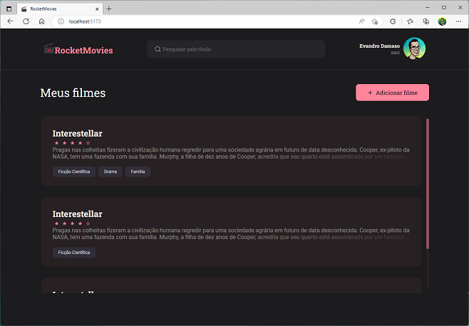

<h1 align="center">
RocketMovies
</h1>

  
   
  
   
  
   
 

   Frontend do projeto RocketMovies

  

<!--  -->

## Back-end

Repositório do back-end do projeto: [Github.com/dam450/movienotes-api](https://github.com/dam450/movienotes-api)
